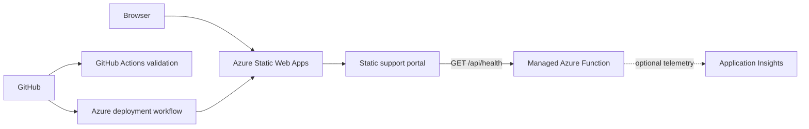

# Azure Customer Success Journey

> **Current status:** Local portal and case-study materials prepared. Azure deployment and live incident exercises pending. The customer is fictional; no customer outcomes have been measured.

A portfolio lab by Luca Puckaß connecting technical support with cloud customer success: understand the customer's goal, enable adoption, investigate blockers, communicate clearly and review value using evidence.

The existing Azure Support Operations Lab remains the technical foundation. The repository name and API identifier are unchanged to preserve existing links and configuration. This is not an employer project, a production service or a claim of professional Azure administration experience.

## Customer story and starting point

**CloudShop** is a fictional small e-commerce business. Its support team needs one shared information and status portal. Real orders, payments, customer records and production shop migration are outside this pilot.

Three proposed success criteria: verify the deployed portal, complete a controlled incident with customer updates, and demonstrate a status/runbook/escalation walkthrough. The customer-health model is separate from the technical API check: HTTP 200 does not prove adoption or customer satisfaction.

- **For Luca:** [Guided learning path (Deutsch)](docs/customer-success/learning-guide-de.md). Next: explain the brief, then deploy the existing portal together.
- **For reviewers:** Start with the [customer brief](docs/customer-success/customer-brief.md) and [evidence register](docs/customer-success/evidence-register.md).
- **For the application:** Run `npm run preview` and open `http://127.0.0.1:4173`. Both the local API simulation and synthetic customer example are labelled.

| Customer success deliverable | Purpose | State |
|---|---|---|
| [Discovery brief](docs/customer-success/customer-brief.md) | Goals, owners, constraints | Fictional case prepared |
| [30/60/90-day success plan](docs/customer-success/success-plan.md) | Milestones and acceptance criteria | Plan, not completed history |
| [Customer health model](docs/customer-success/health-model.md) | Evidence, unknowns and next actions | Model with labelled synthetic example |
| [Communication and escalation](docs/customer-success/customer-communications.md) | Updates, ownership and handoff | Templates, not messages sent |
| [Value review](docs/customer-success/value-review.md) | Outcomes, risks, cost and recommendation | Six-part template; results pending |

The 90-day plan models a lifecycle; it does not require waiting 90 days or pretending that those days occurred. Expansion must serve a demonstrated need. "Do not expand yet" is a valid recommendation.

## Current capabilities

| Capability | State |
|---|---|
| Responsive support operations portal | Implemented locally |
| Browser-based health check with timeout and failure states | Implemented locally |
| Managed Azure Functions health API | Implemented locally |
| Automated repository validation and tests | Implemented locally |
| Security headers for Azure Static Web Apps | Configured locally |
| Free-tier Bicep resource definition | Implemented, not deployed |
| Azure Static Web Apps deployment | Pending |
| Application Insights monitoring | Optional; cost review pending |
| Three controlled incident exercises | Prepared, not yet performed |

## Architecture



The frontend treats a direct local file preview differently from an Azure failure. Locally it reports that the API is not running. After deployment, it calls `/api/health` with a five-second timeout and shows operational or degraded state based on the response.

See [Architecture](docs/architecture.md) for responsibilities, request flow and trust boundaries.

## Repository structure

```text
.
├── .github/workflows/validate.yml
├── api/
│   ├── src/functions/health.js
│   ├── test/health.test.js
│   ├── host.json
│   └── package.json
├── docs/
│   ├── customer-success/
│   ├── incidents/
│   ├── architecture.md
│   ├── deployment-guide.md
│   ├── learning-notes.md
│   ├── security-and-cost-checklist.md
│   └── troubleshooting-runbook.md
├── infrastructure/
│   └── main.bicep
├── scripts/validate-site.mjs
├── tests/site.test.mjs
└── website/
    ├── index.html
    ├── script.js
    ├── customer-success.mjs
    ├── health-model.mjs
    ├── staticwebapp.config.json
    └── styles.css
```

## Local validation

The repository uses only Node's built-in test runner for the frontend checks. The Azure Functions API has one production dependency: `@azure/functions`.

```bash
npm run validate
npm test
cd api
npm install
npm test
```

For a local browser preview with a simulated health endpoint, run `npm run preview`
from the repository root and open `http://127.0.0.1:4173`.

The full frontend and API can later be run together with the Azure Static Web Apps CLI. A direct `index.html` preview remains useful for layout review but does not start the managed API.

## Deployment plan

The first Azure deployment will use the portal so that the repository connection, generated workflow and secret storage are visible and auditable. Planned build settings:

| Setting | Value |
|---|---|
| Plan | Free |
| App location | `/website` |
| API location | `/api` |
| Output location | empty |
| Deployment branch | `main` |

See the complete [Deployment guide](docs/deployment-guide.md).

## Security and cost guardrails

- No secrets, customer data, employer screenshots or internal URLs are stored in the repository.
- The health endpoint returns only service status, version, timestamp and its own runtime check.
- Security headers restrict scripts, styles, network connections, framing and browser permissions.
- The infrastructure template uses the Azure Static Web Apps Free SKU.
- Virtual machines, paid databases, Front Door and Microsoft Sentinel are excluded.
- Application Insights remains optional until its independent pricing has been reviewed and a low budget alert exists.
- Budget alerts notify; they are not a guaranteed spending cap. Check current eligibility, settings and pricing before deployment. Preparing these files creates no cloud resources.

See the [Security and cost checklist](docs/security-and-cost-checklist.md).

## Troubleshooting practice

Prepared exercises cover:

1. a failed GitHub deployment;
2. an Azure RBAC access-denied error;
3. an unavailable managed API.

The exercises are labelled as planned until they have actually been performed. Each final report will include impact, evidence, root cause, resolution, recovery verification and prevention.

See the [Troubleshooting runbook](docs/troubleshooting-runbook.md).

## Development approach

AI assistance was used to scaffold and review parts of the frontend, API, infrastructure template and documentation. The project owner defined the requirements and is responsible for understanding the architecture, validating the implementation, deploying it safely and performing the troubleshooting exercises.

This distinction is intentional: the portfolio targets cloud customer success with hands-on support practice, not professional software-development experience. Luca performs and explains the cloud exercises; results must match the evidence register. Simulated customer data must never be presented as measured customer outcomes.

## Roadmap

- [x] Create the public GitHub repository.
- [x] Define project scope and cost guardrails.
- [x] Build the local support operations portal.
- [x] Implement the managed health API.
- [x] Add automated validation and tests.
- [x] Add the Free-tier Bicep definition.
- [x] Prepare deployment, security and troubleshooting documentation.
- [x] Prepare the fictional customer brief, success plan and review templates.
- [x] Separate customer health from technical service health in the portal.
- [ ] Luca validates the customer brief in his own words.
- [x] Review and publish the Customer Success changes with Luca's approval.
- [ ] Deploy to Azure Static Web Apps Free.
- [ ] Verify the live portal and `/api/health` endpoint.
- [ ] Decide whether to enable Application Insights.
- [ ] Perform and document the three controlled incidents.
- [ ] Complete an onboarding walkthrough, labelled self-test or independent test.
- [ ] Review costs and available evidence; explain unknowns.
- [ ] Complete the mock value review using only evidence-backed lab results.
