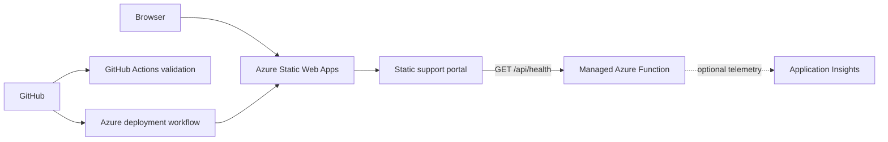

# Azure Support Operations Lab

> **Current status:** Local implementation complete · Azure deployment pending

A hands-on cloud support project built around a small customer-facing status portal. The lab demonstrates deployment, health checks, automated validation, access-control planning, cost awareness and structured incident response in Microsoft Azure.

The application code is intentionally small. The main focus is the operational lifecycle: identify a symptom, collect evidence, isolate the affected component, apply a safe correction, verify recovery and document prevention.

## Current capabilities

| Capability | State |
|---|---|
| Responsive support operations portal | Implemented locally |
| Browser-based health check with timeout and failure states | Implemented locally |
| Managed Azure Functions health API | Implemented locally |
| Automated repository validation and tests | Implemented locally |
| Security headers for Azure Static Web Apps | Configured locally |
| Free-tier Bicep resource definition | Implemented, not deployed |
| Azure Static Web Apps deployment | Pending |
| Application Insights monitoring | Optional; cost review pending |
| Three controlled incident exercises | Prepared, not yet performed |

## Architecture



The frontend treats a direct local file preview differently from an Azure failure. Locally it reports that the API is not running. After deployment, it calls `/api/health` with a five-second timeout and shows operational or degraded state based on the response.

See [Architecture](docs/architecture.md) for responsibilities, request flow and trust boundaries.

## Repository structure

```text
.
├── .github/workflows/validate.yml
├── api/
│   ├── src/functions/health.js
│   ├── test/health.test.js
│   ├── host.json
│   └── package.json
├── docs/
│   ├── incidents/
│   ├── architecture.md
│   ├── deployment-guide.md
│   ├── learning-notes.md
│   ├── security-and-cost-checklist.md
│   └── troubleshooting-runbook.md
├── infrastructure/
│   └── main.bicep
├── scripts/validate-site.mjs
├── tests/site.test.mjs
└── website/
    ├── index.html
    ├── script.js
    ├── staticwebapp.config.json
    └── styles.css
```

## Local validation

The repository uses only Node's built-in test runner for the frontend checks. The Azure Functions API has one production dependency: `@azure/functions`.

```bash
npm run validate
npm test
cd api
npm install
npm test
```

For a local browser preview with a simulated health endpoint, run `npm run preview`
from the repository root and open `http://127.0.0.1:4173`.

The full frontend and API can later be run together with the Azure Static Web Apps CLI. A direct `index.html` preview remains useful for layout review but does not start the managed API.

## Deployment plan

The first Azure deployment will use the portal so that the repository connection, generated workflow and secret storage are visible and auditable. Planned build settings:

| Setting | Value |
|---|---|
| Plan | Free |
| App location | `/website` |
| API location | `/api` |
| Output location | empty |
| Deployment branch | `main` |

See the complete [Deployment guide](docs/deployment-guide.md).

## Security and cost guardrails

- No secrets, customer data or employer-internal information are stored in the repository.
- The health endpoint returns only service status, version, timestamp and its own runtime check.
- Security headers restrict scripts, styles, network connections, framing and browser permissions.
- The infrastructure template uses the Azure Static Web Apps Free SKU.
- Virtual machines, paid databases, Front Door and Microsoft Sentinel are excluded.
- Application Insights remains optional until its independent pricing has been reviewed and a low budget alert exists.

See the [Security and cost checklist](docs/security-and-cost-checklist.md).

## Troubleshooting practice

Prepared exercises cover:

1. a failed GitHub deployment;
2. an Azure RBAC access-denied error;
3. an unavailable managed API.

The exercises are labelled as planned until they have actually been performed. Each final report will include impact, evidence, root cause, resolution, recovery verification and prevention.

See the [Troubleshooting runbook](docs/troubleshooting-runbook.md).

## Development approach

AI assistance was used to scaffold and review parts of the frontend, API, infrastructure template and documentation. The project owner defined the requirements and is responsible for understanding the architecture, validating the implementation, deploying it safely and performing the troubleshooting exercises.

This distinction is intentional: the portfolio demonstrates practical cloud support and operations skills rather than claiming professional software-development experience.

## Roadmap

- [x] Create the public GitHub repository.
- [x] Define project scope and cost guardrails.
- [x] Build the local support operations portal.
- [x] Implement the managed health API.
- [x] Add automated validation and tests.
- [x] Add the Free-tier Bicep definition.
- [x] Prepare deployment, security and troubleshooting documentation.
- [ ] Review and merge the implementation pull request.
- [ ] Deploy to Azure Static Web Apps Free.
- [ ] Verify the live portal and `/api/health` endpoint.
- [ ] Decide whether to enable Application Insights.
- [ ] Perform and document the three controlled incidents.
