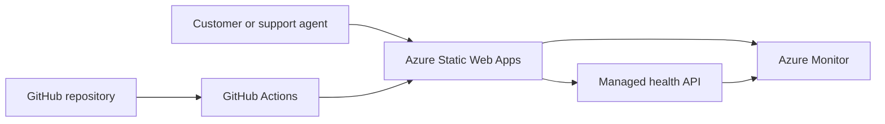

# Azure Support Operations Lab

> **Status:** Planning and initial setup

A hands-on cloud support project that demonstrates how a small customer-facing service can be deployed, monitored, secured and troubleshot in Microsoft Azure.

The project is designed around a realistic support scenario rather than a purely theoretical certification lab. It will document both the working solution and the incidents encountered while building and operating it.

## Project goals

- Deploy a customer support and service-status portal with Azure Static Web Apps.
- Use GitHub Actions for repeatable automated deployments.
- Apply clear resource naming, tagging, access control and cost guardrails.
- Add a lightweight health endpoint and basic monitoring.
- Simulate common failures and document the complete troubleshooting process.
- Recreate the Azure resources with Bicep infrastructure as code.
- Produce support documentation that can be understood by both users and technical teams.

## Planned architecture

## Planned technology

- Microsoft Azure
- Azure Static Web Apps Free plan
- Azure Functions for a minimal health endpoint
- Azure Monitor and alerting
- Azure RBAC, tags and cost management
- GitHub and GitHub Actions
- Bicep infrastructure as code
- HTML, CSS and JavaScript

## Support and incident scenarios

The finished lab will include evidence-based incident reports for:

1. A failed deployment caused by an invalid configuration.
2. An access-denied problem caused by insufficient permissions.
3. An unavailable or unhealthy service endpoint.

Each report will describe the customer impact, symptoms, investigation, root cause, resolution and prevention measures.

## Roadmap

- [x] Create the public GitHub repository.
- [x] Define the project scope and cost limits.
- [ ] Build the first version of the support portal.
- [ ] Deploy the portal to Azure Static Web Apps.
- [ ] Configure continuous deployment with GitHub Actions.
- [ ] Add the health endpoint and monitoring.
- [ ] Complete three controlled troubleshooting scenarios.
- [ ] Recreate the infrastructure using Bicep.
- [ ] Add screenshots, diagrams and final documentation.

## Cost guardrails

The lab is intended to operate within free service allowances. It will avoid virtual machines, paid App Service plans, premium databases and other unnecessary billable resources. Azure costs will be checked before every deployment, and temporary resources will be removed after testing.

## Security principles

- No passwords, deployment credentials or API keys are stored in the repository.
- No real customer or employer data is used.
- Demo data is fictional and contains no personal information.
- Access is granted using least-privilege principles.
- Secrets are stored only in the appropriate GitHub or Azure secret-management interface.

## Documentation

As the project develops, the repository will include:

- architecture overview;
- deployment guide;
- troubleshooting runbook;
- incident reports;
- security and cost checklist;
- lessons learned.

## Purpose

This project supports a professional transition from technical customer support into cloud support and operations. It focuses on transferable skills: structured troubleshooting, clear communication, documentation, escalation and continuous improvement.

---

This repository is a learning project. Features marked as planned are not presented as completed work.
