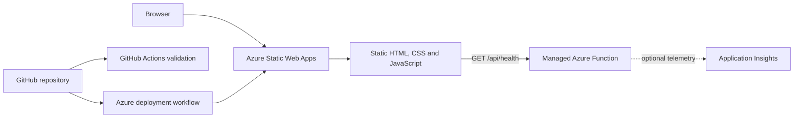

# Architecture

## Customer success layer

The Azure Customer Success Journey reuses this technical foundation. The fictional CloudShop case adds discovery, onboarding, adoption review and incident communication. Its health model runs entirely in the browser, separately from the API, with no CRM integration or customer database. Default ratings are unknown. The alternative day-60 dataset is explicitly synthetic and never updates the evidence register.

The endpoint checks its own runtime, not customer adoption or complete business availability. Local preview uses a simulated endpoint. Azure deployment remains pending. See [customer brief](customer-success/customer-brief.md) and [health model](customer-success/health-model.md).

## Objective

The lab provides a small customer-facing status portal backed by a managed Azure Functions API. It is intentionally simple so the operational concerns remain visible: deployment, health checks, access control, monitoring, cost and incident response.

## Component responsibilities

| Component | Responsibility | Current state |
|---|---|---|
| Static frontend | Presents service state, runbooks and project activity | Implemented locally |
| Health API | Returns service name, version, status and timestamp | Implemented locally |
| GitHub validation | Checks structure and runs automated tests | Implemented locally |
| Azure Static Web Apps | Hosts the frontend and managed API | Deployment pending |
| Application Insights | API request, failure and trace telemetry | Optional; cost review pending |
| Bicep template | Reproducible Free-tier resource definition | Implemented, not deployed |

## Request flow

1. The browser loads the static portal.
2. The frontend requests `/api/health` with a five-second timeout.
3. A successful response marks the API and overall service as operational.
4. A timeout or non-success response changes the interface to a degraded state.
5. In a direct local file preview, the page clearly reports that the API is not running instead of presenting a false failure.

## Trust boundaries

- The public browser never receives Azure credentials.
- The managed API accepts only anonymous `GET` requests and returns no sensitive data.
- GitHub and Azure deployment secrets remain outside the repository.
- No real customer, Telekom or Etsy data is used.

